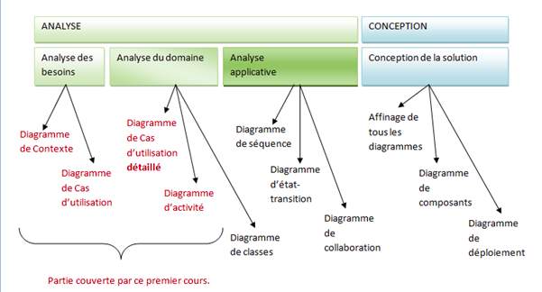
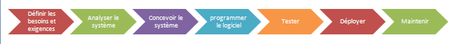
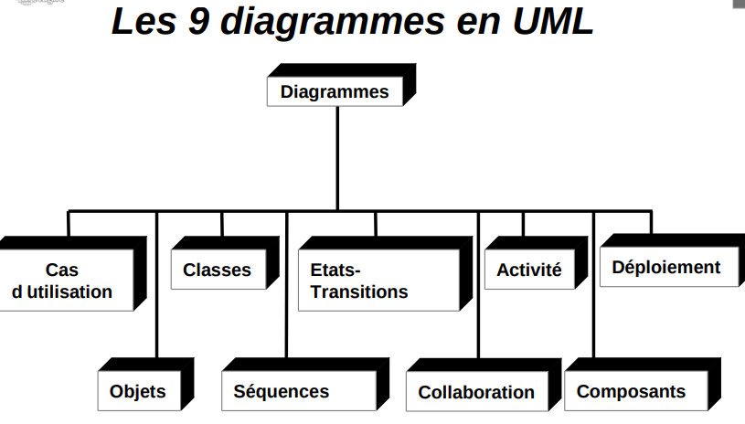

# Problèmatique  
    Un projet informatique = phase analyse + phase conception.
    

# UML
    UML signifie « Unified Modeling Language » ou Langage de modélisation unifié en français. C’est un langage de modélisation qui permet de représenter graphiquement les besoins des utilisateurs. On utilise pour cela des diagrammes.
# Les étapes de développement logiciel
    Le processus de développement logiciel contient un certain nombre d’étapes :
        1- Définir les besoins et les exigences du client et des utilisateurs
        2- Analyser le système
        3- Concevoir le système
        4- Programmer le logiciel
        5- Tester le logiciel
        6- Déployer
        7- Maintenir le système

        

# Les 9 diagrammes
	

# Classe
# Association
# Cardinalites
# Association & cardinalité
# Association avec cardinalité
# Agrégation
# Agrégation Composée
# Agregation Partagée
# Héritage
